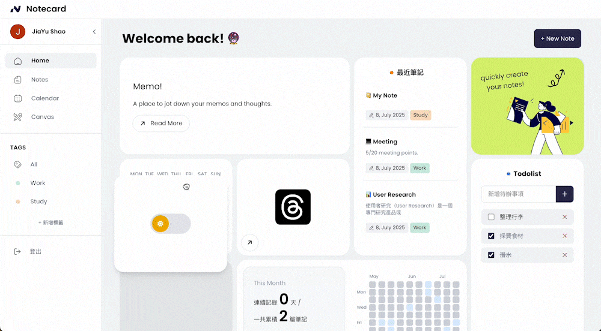
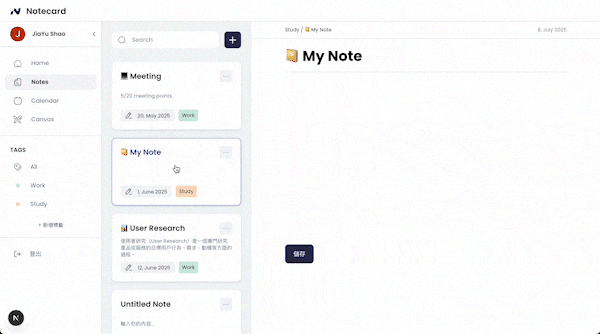

# 📝 noteCard

**noteCard** is a minimalist and powerful markdown note-taking web app designed for fast recording, tag-based organization, and intuitive visual management. Whether you're jotting down quick ideas or organizing your study notes, noteCard helps you focus on your content without distractions.

## 🔍 Features

- **🪄 Card View:**  
  Instantly view all your notes in a clean and scannable card layout. Recent updates and titles are clearly visible for fast browsing.

- **🏷️ Tag Management:**  
  Categorize your notes using custom tags. Filter with ease and recognize your content through tag colors.

- **⌨️ Markdown Support:**  
  Write with markdown and instantly see formatted results. Enjoy a live preview editor with support for bold, italic, code, links, headings, and more.

- **📁 Firebase Firestore Integration:**  
  All notes are stored in real-time with Firestore, keeping your content updated across devices.

- **🌙 Dark Mode:**  
  Toggle between light and dark themes to suit your reading environment.

- **📅 Calendar & Heatmap:**  
  Visualize your writing activity over time and connect notes to calendar events.

---

## 🛠️ Built With

- [Next.js 14 (App Router)](https://nextjs.org/)

---

## Demo

1. **Home Page**｜ Customizable widgets and theme toggle
   

2. **Note Page**｜ Write and manage notes with Markdown support  
   
